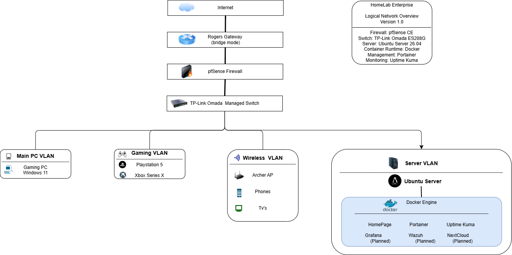
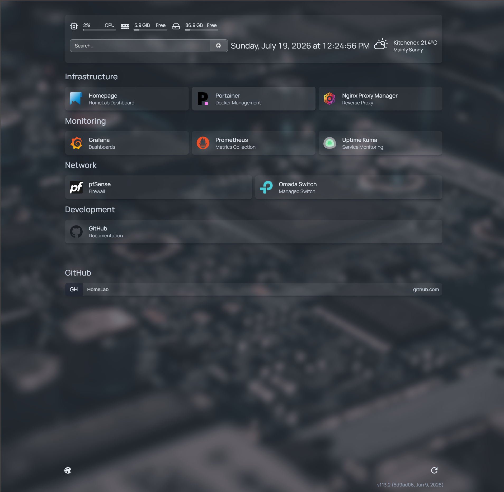

# 🏠 HomeLab

A self-hosted enterprise-style homelab built to develop practical skills in networking, Linux administration, Docker, monitoring, reverse proxying, and cybersecurity.

This repository documents the infrastructure, configurations, and services running in my lab.

---

## 🖥️ Network Architecture



---
## 🚀 Infrastructure

- Ubuntu Server
- Docker & Docker Compose
- Portainer
- Homepage Dashboard
- Nginx Proxy Manager
- Git & GitHub

---

## 📊 Monitoring

- Grafana
- Prometheus
- Node Exporter
- Uptime Kuma

Features include:

- Real-time system monitoring
- Service health monitoring
- Performance dashboards
- Resource utilization metrics

---

## 🌐 Network

Network components include:

- pfSense Firewall
- TP-Link Omada Managed Switch
- VLAN segmentation
- Reverse Proxy
- Static DHCP Reservations

---

## 📁 Repository Structure

```text
docker/
├── homepage/
├── monitoring/
├── nginx-proxy-manager/

docs/
├── diagrams/
├── homepage/
├── monitoring/
└── networking/
```

---

## 📸 Dashboard

> *(Insert Homepage screenshot here)*



---

## 🎯 Goals

This homelab is designed to gain hands-on experience with:

- Linux Administration
- Docker
- Networking
- Monitoring
- Reverse Proxy
- Infrastructure Documentation
- Cybersecurity
- Automation

---

## 🔨 Planned Services

- Wazuh SIEM
- Authentik SSO
- CrowdSec
- Vaultwarden
- Immich
- Jellyfin
- Ansible

---

## 📚 Documentation

Each service has its own documentation covering:

- Installation
- Configuration
- Networking
- Troubleshooting
- Maintenance

---

## 🛠️ Technologies

- Ubuntu Server
- Docker
- Docker Compose
- Grafana
- Prometheus
- Node Exporter
- Uptime Kuma
- Homepage
- Portainer
- Nginx Proxy Manager
- pfSense
- Git
- GitHub

---

## 📈 Project Status

Current Phase:

✅ Infrastructure Complete

🔄 Documentation Improvements

⏳ Security Stack (Wazuh)

⏳ Identity Management (Authentik)

⏳ Automation
